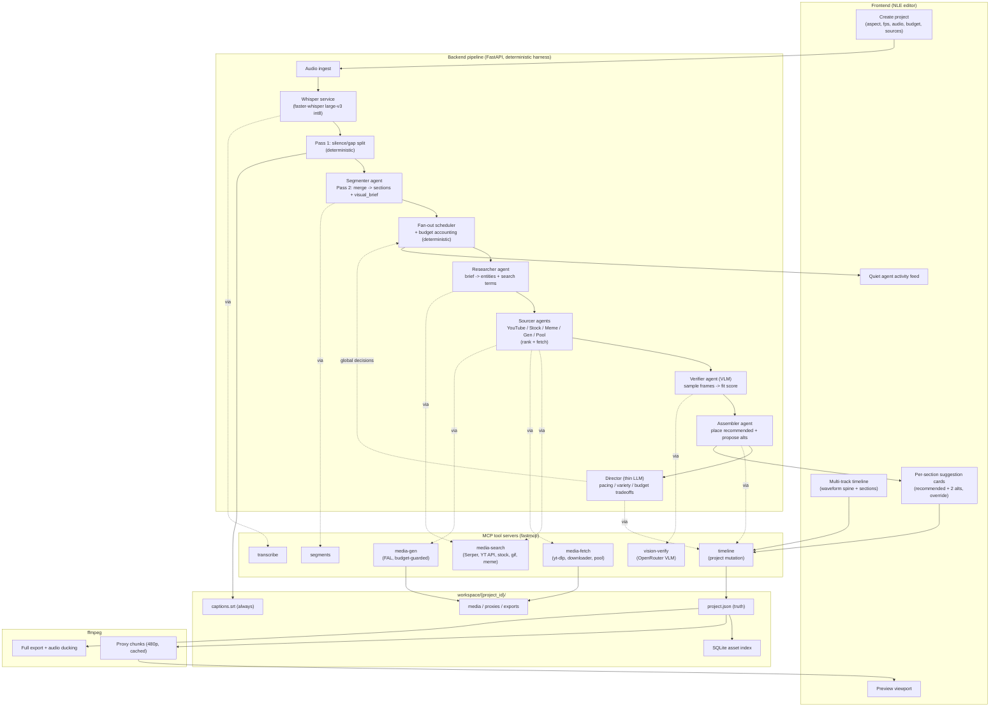

# lazier — architecture diagram

Key reading: the **solid spine** is deterministic Python (audio -> whisper -> pass1 -> ... -> assembled timeline). The named "agent" boxes are the only LLM judgment steps, and each reaches the world **only through an MCP server** (dotted lines), never raw. Media files flow into `workspace/` and the agents see them as `asset_id` handles, never bytes. The timeline `project.json` is the single source of truth; both the proxy preview and the final export are derived from it by ffmpeg.
